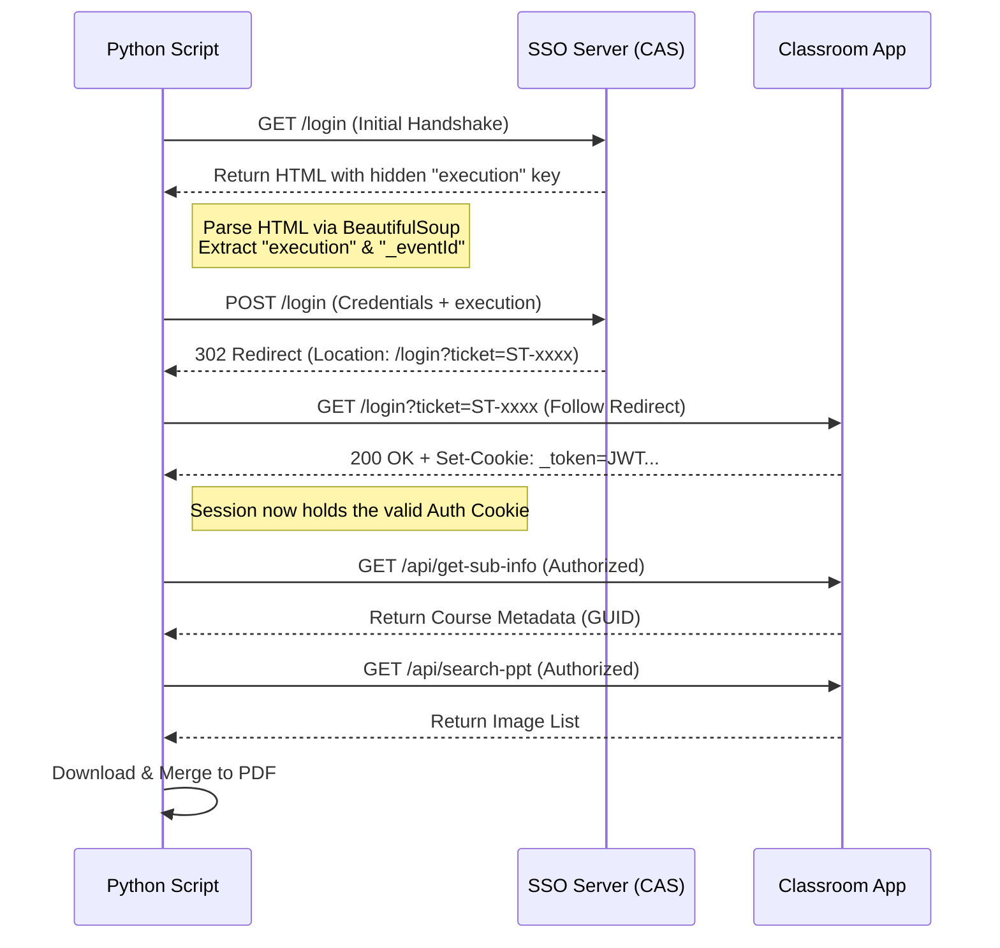

# 🎓 BUAA Classroom PPT Exporter (Protocol Edition)

<div align="center">


**专为北航 `Classroom` 网课平台打造的极致轻量化 PPT 导出工具。**
<br>
*CAS 协议逆向 · 无需浏览器驱动 · 纯 Python 实现 · PDF 无损合成*

[核心优势](#-核心优势) • [快速开始](#-快速开始) • [配置指南](#-配置指南) • [技术内幕](#-技术内幕) • [免责声明](#-免责声明)

</div>

---

## 📖 简介 | Introduction

**BUAA Classroom PPT Exporter** 是一个基于纯 HTTP 协议逆向的自动化工具。与传统的自动化测试方案（如 Selenium）不同，本项目通过深度分析 **BUAA CAS (Unified Authentication)** 登录协议，直接在代码层面模拟了完整的票据交换与 Session 握手过程。

这意味着你**不需要**安装 Chrome 驱动，**不需要**打开浏览器窗口，脚本以最低的系统资源占用，实现毫秒级的登录与数据抓取，并将分散的时间戳图片流重组为高清无损的 PDF 文档。

## ✨ 核心优势 | Key Features

*   **⚡ 极致轻量 (Lightweight)**：摒弃笨重的 Selenium/WebDriver，仅依赖 `requests` 和 `bs4`，运行内存占用极低，可在服务器/树莓派上流畅运行。
*   **🔐 CAS 协议级模拟 (Protocol Simulation)**：内置 CAS 登录流程解析器，自动提取页面隐藏的 `execution` 密钥与 `_eventId`，完美复刻浏览器的加密登录行为。
*   **🍪 智能 Cookie 管理 (Session Persistence)**：自动处理 302 重定向与跨域 Ticket 交换，精确捕获核心 `_token` Cookie，实现无感鉴权。
*   **📄 无损 PDF 封装 (Lossless Export)**：基于 `img2pdf` 技术，直接封装原始 JPEG 数据流，杜绝二次编码导致的画质损失与体积膨胀。
*   **🤖 全自动化 (Fully Automated)**：一键启动 -> 自动鉴权 -> 解析元数据 -> 并发下载 -> 清理缓存 -> 输出 PDF。

## 🚀 快速开始 | Quick Start

### 1. 环境准备
确保你的环境中已安装 Python 3.x。

### 2. 获取代码
下载本项目文件（例如 `main.py`）。

### 3. 安装依赖
本项目仅需安装 3 个核心库：
```bash
pip install requests beautifulsoup4 img2pdf
```

## ⚙️ 配置指南 | Configuration

打开脚本文件，修改顶部的配置区域：

```python
# ================= 配置区 =================
# 1. 你的北航统一认证账号
USERNAME = "23000000"

# 2. 你的统一认证密码
PASSWORD = "YourPassword"

# 3. 你想下载的课程链接 (直接复制浏览器地址栏)
TARGET_COURSE_URL = "https://classroom.msa.buaa.edu.cn/livingroom?course_id=xxxxx&sub_id=xxxxx..."
# ==========================================
```

**运行脚本：**
```bash
python main.py
```

## 🧠 技术内幕 | Under the Hood

本项目通过逆向工程还原了北航 SSO 的登录状态机：



1.  **密钥提取**: 首次请求登录页时，使用 `BeautifulSoup` 从 DOM 树中剥离出动态生成的 `execution` 令牌，这是通过 CAS 验证的唯一凭证。
2.  **票据交换**: 携带账号、密码及令牌发送 POST 请求，获取 Service Ticket (ST)。
3.  **Cookie 注入**: 自动跟随重定向至业务系统，利用 `requests.Session` 自动捕获服务器下发的 `_token` Cookie，完成身份固化。

## ⚠️ 免责声明 | Disclaimer

*   本项目代码仅供 **技术研究与个人学习** 使用。
*   脚本模拟了正常的用户登录行为，但请勿高频滥用，以免对学校服务器造成压力。
*   严禁将下载的课件用于商业用途。
*   使用本工具所产生的任何后果由使用者自行承担。

---
<div align="center">
Made with ❤️ by BHYer
</div>