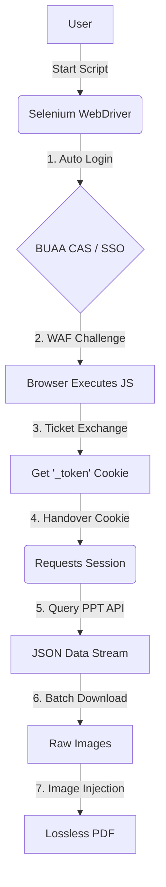

# 🎓 BUAA Classroom PPT Exporter

<div align="center">


**一款专为北航 `Classroom` 网课平台打造的高性能 PPT 导出工具。**
<br>
*自动化登录 · WAF 穿透 · 高清原图 · PDF 无损合成*

[功能特性](#-功能特性) • [安装指南](#-安装指南) • [使用说明](#-使用说明) • [技术原理](#-技术原理) • [免责声明](#-免责声明)

</div>

---

## 📖 简介 | Introduction

**BUAA Classroom PPT Exporter** 是一个基于 Python 的自动化工具，旨在解决北航网课平台（Classroom）课件无法直接下载的问题。

该项目采用 **Selenium + Requests 混合架构**，利用 Selenium 模拟真实用户行为通过北航统一认证（CAS）及 Web 应用防火墙（WAF），获取高权限 Cookie 后，无缝切换至 Requests 模块进行高并发数据抓取。它能够将分散的时间戳图片流自动重组，并合成无损的 PDF 文档，完美辅助课程复习。

## ✨ 功能特性 | Features

*   **🛡️ 智能 WAF 穿透**：通过全真浏览器环境模拟，自动处理 JS 质询与重定向，完美绕过 ZTE WAF 防火墙及 CAS 复杂鉴权。
*   **🚀 混合引擎加速**：
    *   **登录层**：使用 `Selenium` 处理复杂的动态 Token 交换。
    *   **下载层**：自动迁移 Cookie 至 `Requests` Session，实现轻量级、低延迟的高速图片下载。
*   **📄 无损 PDF 合成**：基于 `img2pdf` 技术，直接封装 JPEG 数据流而非重编码，确保生成的 PDF 体积最小且画质 100% 还原。
*   **🤖 全自动流程**：只需提供学号、密码和课程链接，脚本自动完成 解析 -> 鉴权 -> 抓取 -> 清理 -> 合成 全流程。
*   **🔍 智能元数据解析**：自动调用 API 获取课程名称、章节信息，自动命名输出文件。

## 🛠️ 安装指南 | Installation

### 1. 环境准备
确保你的环境中已安装 Python 3.8 或更高版本，并安装了 Chrome 浏览器。

### 2. 克隆项目
```bash
git clone https://github.com/your-username/buaa-classroom-exporter.git
cd buaa-classroom-exporter
```

### 3. 安装依赖
我们只需要以下几个核心库：
```bash
pip install requests selenium webdriver-manager img2pdf beautifulsoup4
```

## 🚀 使用说明 | Usage

### 1. 配置参数
打开脚本文件（例如 `main.py`），找到顶部的 **用户配置区**，填入你的北航统一认证账号信息：

```python
# ================= 用户配置区 =================
USERNAME = "23000000"       # 你的学号
PASSWORD = "YourPassword"   # 你的统一认证密码
TARGET_COURSE_URL = "https://classroom.msa.buaa.edu.cn/livingroom?course_id=xxxxx&sub_id=xxxxx"
# ============================================
```

### 2. 运行脚本
在终端中直接运行：
```bash
python main.py
```

### 3. 等待完成
脚本将自动启动一个隐形浏览器窗口进行登录，随后你会看到详细的进度日志。完成后，当前目录下会生成一个以课程名为标题的 `.pdf` 文件。

## 🧠 技术原理 | Architecture

本工具采用了一种 **"Browser-to-API Handover" (浏览器-API 交接)** 的设计模式：



1.  **身份获取 (The Heist)**: 启动 Selenium 模拟真实用户登录 SSO，等待浏览器自动执行 WAF 的 JavaScript 脚本，直到本地 Cookie 中写入 `_token`。
2.  **状态转移 (The Handover)**: 将 Selenium 捕获的完整 Cookie 字典注入到 Python `requests.Session` 对象中。
3.  **高速作业 (The Job)**: 关闭笨重的浏览器，使用轻量的 Requests 会话直接请求后端 API 接口，批量并发下载图片。

## ⚠️ 免责声明 | Disclaimer

*   本项目仅供 **北航校内学生个人学习、复习使用**。
*   严禁将下载的课件用于商业用途或在未经授权的公开平台传播。
*   脚本并未包含任何攻击性代码，但高频请求可能会给服务器带来压力，请**合理控制使用频率**。
*   使用本工具产生的任何后果由使用者自行承担。

---
<div align="center">
Made with ❤️ by BHYer
</div>